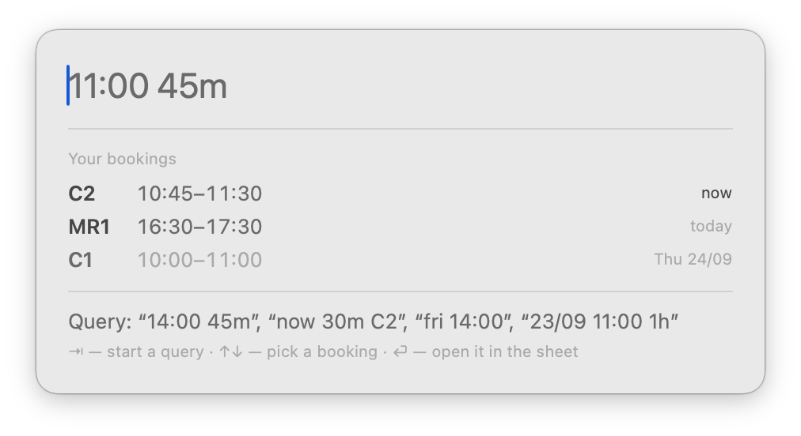
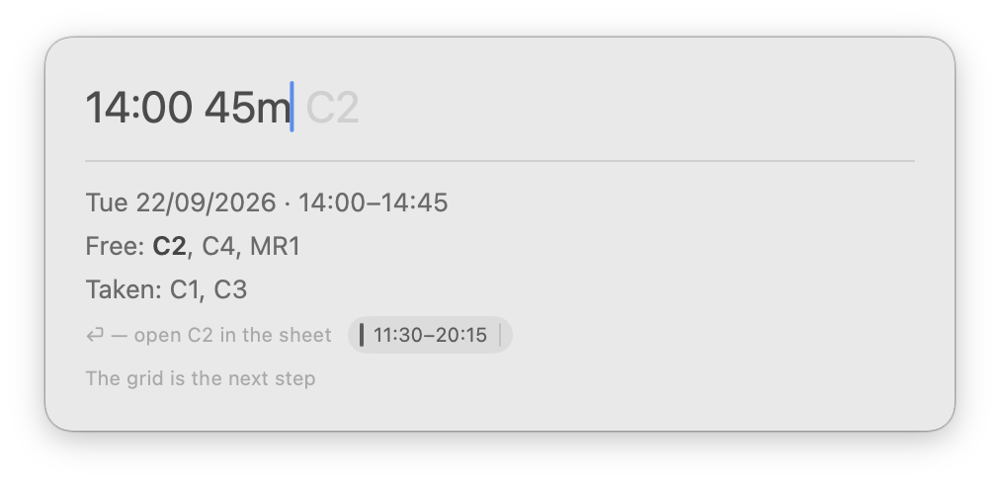
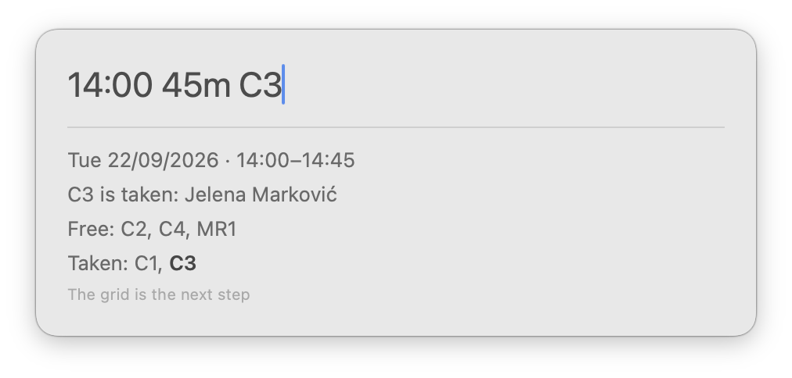

# Nook

A booking helper for coworking meeting rooms and phone booths. A native macOS
app: a global hot key brings up an overlay on top of whatever you are working
in, and it answers the question “where can I sit at two for forty-five
minutes?”

**Status**: works as a text helper; the calendar grid is not built yet.
**Stack**: Swift 6, SwiftUI + AppKit, macOS 14+.
**Languages**: English, Russian, Serbian (Cyrillic and Latin) — taken from the
system, falling back to English.

---

## What it looks like

Open it and it has already answered — your own nearest bookings, each with how
soon it is. ↑↓ walk them, ⏎ opens one in the sheet.



Type a time and it says where there is room — and how much room there is around
the request, so a gap wedged between two bookings is not mistaken for an empty
afternoon.



Name a space and the answer is about that space: free, or taken and by whom,
with what is free instead on the line below.



The pictures are taken against made-up data, which is what `--demo` is for:

```bash
Nook.app/Contents/MacOS/Nook --demo --show-overlay "14:00 45m"
```

The real sheet is read **without authorisation**, so a screenshot of it would
publish the name of everybody who booked a room that week — and a PNG is the
one thing a pre-commit hook cannot read. `--demo` also gives the app a settings
domain of its own, so trying it out cannot disturb a sheet you have configured.

## Why

Bookings live in a shared Google Sheet: a tab per space, a weekly grid, a name
typed into a cell. That layout answers “when is C1 free” and does not answer
“where is there room right now” — for that you have to line up eight tabs by
eye.

Nook turns the cut around: it reads every tab at once and tells you which
spaces are free for the interval you asked about.

```
Google Sheets ──CSV export──▶ NookSheet ──▶ NookCore ──▶ Nook (SwiftUI)
  8 tabs                      parsing       finding       NSPanel overlay
  10 dates × 49 slots         the schedule  free windows  + global hot key
```

The app **does not write** to the sheet: on ⏎ it opens the browser with the
caret on exactly the right cell of the right tab, and you type the name in
yourself. That keeps the first version free of OAuth, and unable to damage a
document the whole team depends on.

## Installing

```bash
make install   # build and put it in /Applications
make run       # the same, then launch it
```

You need Xcode 16 or newer — the package is `swift-tools-version: 6.0` — and
[XcodeGen](https://github.com/yonaskolb/XcodeGen) (`brew install xcodegen`):
the `.xcodeproj` is generated from `project.yml` and is not kept in the
repository.

The app lives in the menu bar and has no Dock icon. Turn on “Launch at login”
in its settings, or you will have to start it by hand after every restart.

The build is signed ad-hoc, which is all it takes to run and asks for no Apple
account of any kind. Nothing you build here is quarantined, so Gatekeeper stays
out of the way. To sign with a certificate of your own:
`DEVELOPMENT_TEAM=XXXXXXXXXX make install`.

There are no binary releases, and that is deliberate: an ad-hoc signature
cannot be notarised, so a downloaded copy would be refused on someone else's
Mac. Building it yourself is the supported route, and it is one command.

## Configuring

On first launch Nook asks for a link to the booking sheet — paste the whole
link from the browser. It is stored on your machine only (`UserDefaults`) and
is not in this repository: the sheet is read **without authorisation**, so its
identifier amounts to access to every booking name in it.

The sheet has to be readable by link and laid out like this: a tab per space,
dates in row 3, times in column A in 15-minute steps, and the name of whoever
holds the slot in the cell. Spaces, and the tab each one lives in, are declared
in `Sources/NookCore/Space.swift` — that is the list to edit for another
coworking.

## Asking

A request is a time plus, if you want, a duration, a space and a day:

```
14:00 45m            now 30m C2            fri 14:00            23/09 11:00 1h 30m
```

The order is free, and parsing understands the words of all three languages at
once. A weekday means the nearest one ahead, today included; a date is written
with slashes only. Past an hour a duration is written as hours with minutes —
`1h 30m`, `1ч 30м`, `1h30m` all mean ninety, and that is how it is written
back: `150m` is legible only after doing the arithmetic.

A named day on its own is a beginning too. Type `tomorrow` — or `завтра`,
`wed`, `23/09` — and the hour it would take is shown in grey; ⇥ enters it, the
way it does after `now`.

| Key | What it does |
|---|---|
| ⌥Space | Show or hide the overlay — the combination is a setting |
| ⇥ | Complete the next part of the request |
| ↑↓ | Change whatever the caret is on: hour, minutes, duration, day, space |
| ⏎ | Open the cell in the sheet |
| Esc | Close |

The arrows behave like a stepper: ↑ means more, ↓ means less. Spaces cycle
through the free ones only, days through the ones the sheet actually holds.

Settings offer a few combinations, a recorder for your own, and “off” — the
menu bar still opens the overlay either way. A combination needs a modifier:
a bare key would be taken away from every other application, so only function
keys are allowed to stand alone. The binding is by physical key, so a
combination survives a keyboard-layout switch; its label follows the layout,
which is why `⌃⌥N` reads `⌃⌥Т` on a Russian one.

Running the overlay without the hot key — to look at it from a terminal, say:

```bash
.build/xcode/Build/Products/Debug/Nook.app/Contents/MacOS/Nook --show-overlay "14:00 45m C2"
.build/xcode/Build/Products/Debug/Nook.app/Contents/MacOS/Nook --show-settings
.build/xcode/Build/Products/Debug/Nook.app/Contents/MacOS/Nook --demo --show-overlay
```

Note that through `open --args` an argument with spaces and colons arrives
truncated, so the binary has to be launched directly.

## How it is put together

| Module | Responsibility | Depends on |
|---|---|---|
| `NookCore` | Model, request parsing, finding free windows, the `ScheduleSource` protocol | nothing |
| `NookSheet` | The Google Sheet adapter: CSV export, tab parsing, cell addressing | `NookCore` |
| `Nook` | Overlay, hot key, menu bar, settings | both |

The core does not know where bookings are kept. It asks a `ScheduleSource`
for a `Schedule` and, when someone wants to write a booking in, for a link to
send them to. Everything Google-shaped — the document address, the layout of
its tabs, the naming of a cell — lives in `NookSheet` behind that protocol.

Pointing Nook at something else (a calendar, a service of your own) means
writing one conformance; the searching, parsing and editing above it stay
untouched. There is a test that does exactly this with an in-memory source.

`NookCore` does no I/O, so all of the logic is covered by tests that need no
network:

```bash
swift test         # the canonical run — this is what CI does
make test-xcode    # the same tests through the Xcode project, what ⌘U runs
```

The test targets are declared twice: once in `Package.swift`, once in
`project.yml`. The second copy exists so the generated project is not a
half-broken thing in the editor — without it the test files belong to no
target and Xcode marks every `import Testing` as unresolved. CI runs both
paths, so the copies cannot drift apart quietly.

## Licence

MIT — see [LICENSE](LICENSE).
